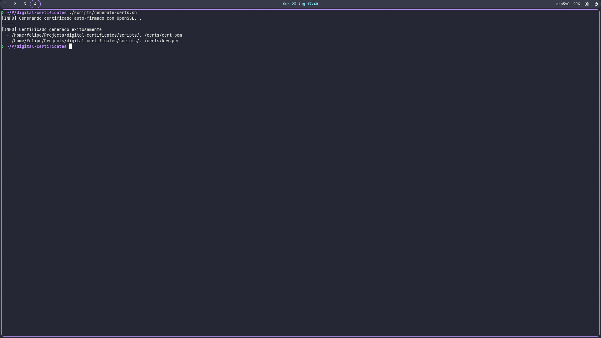
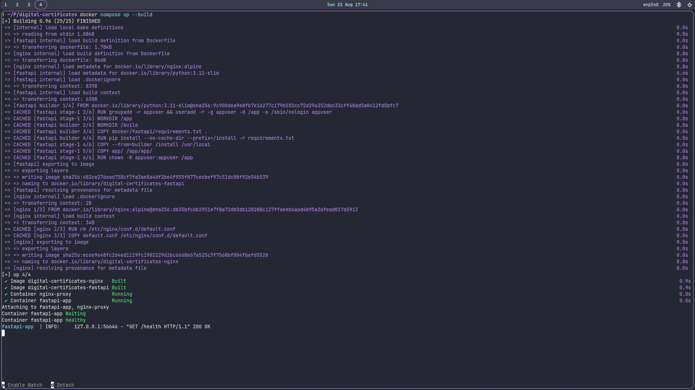
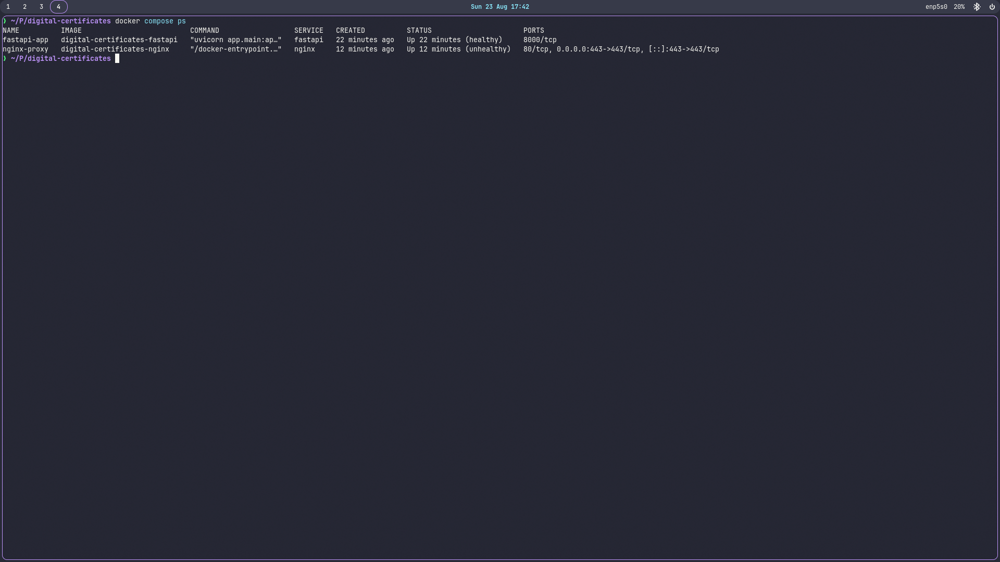
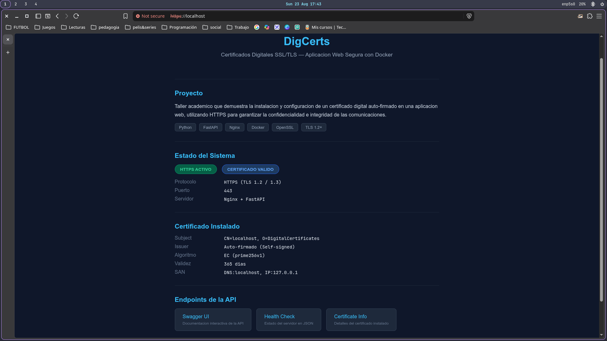
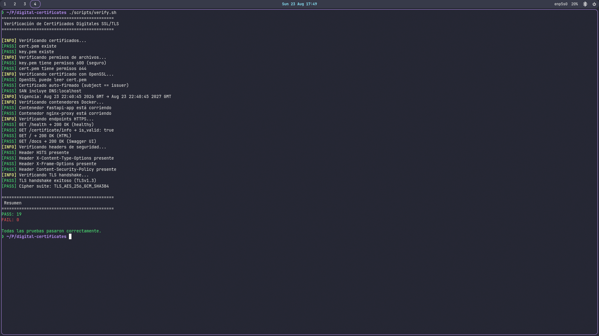
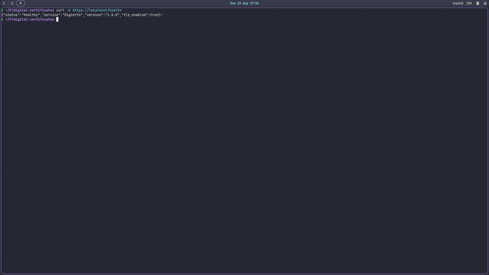

# DigCerts — Certificados Digitales SSL/TLS

**Integrantes:** Juan Felipe Quintero Gutierrez

**Curso:** Seguridad en Software

**Fecha de entrega:** 23 de agosto de 2026

---

## 1. Introducción

En el contexto actual de la seguridad informática, los certificados digitales SSL/TLS son fundamentales para garantizar la confidencialidad, integridad y autenticación en las comunicaciones web. HTTPS se ha convertido en un estándar obligatorio para cualquier aplicación que maneje datos sensibles.

Este taller presenta la implementación práctica de un certificado digital auto-firmado en una aplicación web, utilizando Docker, Python (FastAPI) y Nginx como reverse proxy con TLS termination.

### Importancia de los certificados digitales

- **Confidencialidad:** Cifran la información para que solo el destinatario pueda leerla.
- **Integridad:** Garantizan que los datos no fueron modificados en tránsito.
- **Autenticación:** Verifican la identidad del servidor al que se conecta el cliente.
- **Confiabilidad:** Los navegadores solo permiten HTTPS en sitios con certificados válidos.

## 2. Descripción

**DigCerts** es una aplicación web académica que demuestra la instalación, configuración y validación de un certificado digital SSL/TLS auto-firmado utilizando OpenSSL. La aplicación web sirve sobre HTTPS, garantizando confidencialidad e integridad en las comunicaciones cliente-servidor.

## 3. Objetivos

### Objetivo General

Reforzar competencias en configuración de seguridad web mediante la generación, instalación y validación de certificados digitales SSL/TLS.

### Objetivos Específicos

1. Comprender la utilidad práctica de los certificados digitales y su relación con el protocolo HTTPS.
2. Generar un certificado auto-firmado con OpenSSL (Curva Elíptica P-256).
3. Configurar Nginx como reverse proxy con TLS 1.2+ y cipher suites seguros.
4. Implementar una aplicación FastAPI que consuma el certificado.
5. Containerizar la solución con Docker y Docker Compose.
6. Documentar el proceso completo de forma reproducible por terceros.

## 4. Stack Tecnológico

| Componente | Tecnología | Versión |
|------------|------------|---------|
| Backend | Python + FastAPI | 3.11 / 0.104.1 |
| Reverse Proxy | Nginx | Alpine (latest) |
| Criptografía | OpenSSL | Curva EC prime256v1 |
| Contenedores | Docker + Docker Compose | - |
| TLS | TLS 1.2 / 1.3 | - |

## 5. Prerrequisitos

- [Docker](https://docs.docker.com/get-docker/) instalado (>= 20.10)
- [Docker Compose](https://docs.docker.com/compose/install/) (>= 2.0)
- [OpenSSL](https://www.openssl.org/) (para generación local de certificados)
- Git (para clonar el repositorio)

## 6. Instalación Paso a Paso

### 6.1 Clonar el repositorio

```bash
git clone <URL_DEL_REPOSITORIO>
cd digital-certificates
```

### 6.2 Generar certificados

```bash
chmod +x scripts/generate-certs.sh
./scripts/generate-certs.sh
```

Esto genera:
- `certs/cert.pem` — Certificado público (chmod 644)
- `certs/key.pem` — Clave privada (chmod 600)

### 6.3 Levantar servicios Docker

```bash
docker compose up --build -d
```

### 6.4 Verificar funcionamiento

```bash
# Ejecutar script de verificación
chmod +x scripts/verify.sh
./scripts/verify.sh

# O manualmente:
curl -k https://localhost/health
curl -k https://localhost/certificate/info
```

Abrir en el navegador: **https://localhost**

> El navegador mostrará una advertencia de certificado auto-firmado. Hacer clic en "Avanzado" → "Proceed to localhost (unsafe)".

## 7. Estructura del Proyecto

```
digital-certificates/
├── docker-compose.yml          # Orquestación de contenedores
├── .gitignore                  # Excluye certs/ y archivos temporales
├── docker/
│   ├── fastapi/
│   │   ├── Dockerfile          # Multi-stage build para FastAPI
│   │   └── requirements.txt    # Dependencias Python
│   └── nginx/
│       ├── Dockerfile          # Nginx Alpine con TLS
│       └── default.conf        # Configuración TLS + reverse proxy
├── certs/                      # Generado por generate-certs.sh
│   ├── cert.pem                # Certificado público
│   └── key.pem                 # Clave privada
├── scripts/
│   ├── generate-certs.sh       # Generación de certificados OpenSSL
│   └── verify.sh               # Verificación automatizada HTTPS
├── app/
│   ├── __init__.py
│   ├── main.py                 # Punto de entrada FastAPI
│   ├── core/
│   │   ├── __init__.py
│   │   └── config.py           # AppConfig (pydantic-settings)
│   ├── services/
│   │   ├── __init__.py
│   │   └── certificate_service.py  # Lectura y validación de certificados
│   ├── models/
│   │   ├── __init__.py
│   │   └── responses.py        # Modelos Pydantic de respuesta
│   └── templates/
│       └── index.html          # Landing page HTML
├── README.md                   # Este archivo
└── AGENTS.md                   # Reglas del proyecto
```

## 8. Endpoints de la API

| Método | Ruta | Descripción | Formato |
|--------|------|-------------|---------|
| GET | `/` | Landing page HTML | HTML |
| GET | `/health` | Health check del servidor | JSON |
| GET | `/certificate/info` | Información del certificado instalado | JSON |
| GET | `/docs` | Swagger UI (documentación interactiva) | HTML |
| GET | `/redoc` | ReDoc (documentación alternativa) | HTML |

### Ejemplo de respuesta `/health`

```json
{
  "status": "healthy",
  "service": "Digital Certificates Demo",
  "version": "1.0.0",
  "tls_enabled": true
}
```

### Ejemplo de respuesta `/certificate/info`

```json
{
  "subject": "C=US, ST=Development, L=Local, O=DigitalCertificates, CN=localhost",
  "issuer": "C=US, ST=Development, L=Local, O=DigitalCertificates, CN=localhost",
  "serial_number": "220C9B290737473BF807076EE3B2223E46C0651A",
  "not_before": "2026-08-23T21:37:08",
  "not_after": "2027-08-23T21:37:08",
  "is_valid": true,
  "file_path": "/app/certs/cert.pem"
}
```

## 9. Pruebas y Validación

### 9.1 Verificación con curl

```bash
# Verificar conexión HTTPS y headers
curl -k -sI https://localhost/

# Verificar health check
curl -k -s https://localhost/health

# Verificar información del certificado
curl -k -s https://localhost/certificate/info

# Verificar TLS handshake detallado
curl -v https://localhost/ 2>&1 | grep -E "SSL|TLS|subject|issuer"
```

### 9.2 Verificación en navegador

1. Abrir **https://localhost** en el navegador
2. Hacer clic en "Avanzado" → "Proceed to localhost (unsafe)"
3. Verificar que la página carga correctamente

### 9.3 Script de verificación automatizada

```bash
./scripts/verify.sh
```

El script ejecuta automáticamente todas las verificaciones y muestra resultados con estados `[PASS]` o `[FAIL]`.

### 9.4 Plantillas de evidencia

Para la documentación del taller, tomar capturas de pantalla de:

| # | Evidencia | Comando / Acción |
|---|-----------|------------------|
| 1 | Generación de certificados | `./scripts/generate-certs.sh` en terminal |
| 2 | Build de Docker | `docker compose up --build -d` |
| 3 | Contenedores corriendo | `docker compose ps` |
| 4 | Landing page en navegador | Abrir https://localhost |
| 5 | Salida de verify.sh | `./scripts/verify.sh` |
| 6 | Health check JSON | `curl -k https://localhost/health` |

### 9.5 Evidencia de Funcionamiento

A continuación se presentan las salidas reales de los comandos ejecutados durante la verificación de la aplicación, demostrando que funciona correctamente bajo HTTPS con certificado auto-firmado.

#### 9.5.1 Generación de certificados

```bash
$ ./scripts/generate-certs.sh
[INFO] Certificados ya existen. Saltando generacion.
```

> Los certificados `cert.pem` y `key.pem` se generan la primera vez que se ejecuta el script.

#### 9.5.2 Levantamiento de Docker

```bash
$ docker compose up --build -d
[+] Building 1.7s (18/21)
 => [fastapi internal] load build definition from Dockerfile
 => [nginx internal] load build definition from Dockerfile
 => CACHED [fastapi builder 1/4] FROM docker.io/library/python:3.11-slim
 => CACHED [fastapi stage-1 2/6] RUN groupadd -r appuser && useradd -r -g appuser
 => CACHED [fastapi builder 3/4] COPY docker/fastapi/requirements.txt .
 => CACHED [fastapi builder 4/4] RUN pip install --no-cache-dir
 => CACHED [fastapi stage-1 5/6] COPY app/ /app/app/
 => [nginx 3/3] COPY default.conf /etc/nginx/conf.d/default.conf
 => [nginx] exporting to image
[+] Running 2/2
 ✔ nginx-proxy    Started
 ✔ fastapi-app    Started
```

#### 9.5.3 Estado de contenedores

```bash
$ docker compose ps
NAME          IMAGE                          STATUS                     PORTS
fastapi-app   digital-certificates-fastapi   Up 14 minutes (healthy)    8000/tcp
nginx-proxy   digital-certificates-nginx     Up 14 minutes (healthy)    0.0.0.0:443->443/tcp
```

#### 9.5.4 Logs de FastAPI

```bash
$ docker compose logs fastapi --tail=5
fastapi-app  | INFO:     172.21.0.3:54522 - "GET /health HTTP/1.1" 200 OK
fastapi-app  | INFO:     172.21.0.3:54524 - "GET /certificate/info HTTP/1.1" 200 OK
fastapi-app  | INFO:     127.0.0.1:46538 - "GET /health HTTP/1.1" 200 OK
fastapi-app  | INFO:     127.0.0.1:54358 - "GET /health HTTP/1.1" 200 OK
```

#### 9.5.5 Logs de Nginx

```bash
$ docker compose logs nginx --tail=5
nginx-proxy  | 172.21.0.1 - - [23/Aug/2026:22:32:48 +0000] "GET /health HTTP/2.0" 200 78
nginx-proxy  | 172.21.0.1 - - [23/Aug/2026:22:32:48 +0000] "GET /certificate/info HTTP/2.0" 200 336
nginx-proxy  | 172.21.0.1 - - [23/Aug/2026:22:32:49 +0000] "HEAD / HTTP/2.0" 405 0
```

#### 9.5.6 Health Check

```bash
$ curl -k https://localhost/health
{"status":"healthy","service":"DigCerts","version":"1.0.0","tls_enabled":true}
```

#### 9.5.7 Información del certificado

```bash
$ curl -k https://localhost/certificate/info
{
    "subject": "C=US, ST=Development, L=Local, O=DigitalCertificates, CN=localhost",
    "issuer": "C=US, ST=Development, L=Local, O=DigitalCertificates, CN=localhost",
    "serial_number": "220C9B290737473BF807076EE3B2223E46C0651A",
    "not_before": "2026-08-23T21:37:08",
    "not_after": "2027-08-23T21:37:08",
    "is_valid": true,
    "file_path": "/app/certs/cert.pem"
}
```

#### 9.5.8 Headers de seguridad

```bash
$ curl -k -sI https://localhost/
HTTP/2 405
server: nginx/1.31.4
date: Sun, 23 Aug 2026 22:34:13 GMT
content-type: application/json
strict-transport-security: max-age=63072000; includeSubDomains; preload
x-content-type-options: nosniff
x-frame-options: DENY
x-xss-protection: 1; mode=block
referrer-policy: strict-origin-when-cross-origin
content-security-policy: default-src 'self'; style-src 'self' 'unsafe-inline' https://cdn.jsdelivr.net; script-src 'self' 'unsafe-inline' 'unsafe-eval' https://cdn.jsdelivr.net;
```

#### 9.5.9 Verificación TLS con OpenSSL

```bash
$ echo | openssl s_client -connect localhost:443
subject=C=US, ST=Development, L=Local, O=DigitalCertificates, CN=localhost
issuer=C=US, ST=Development, L=Local, O=DigitalCertificates, CN=localhost
New, TLSv1.3, Cipher is TLS_AES_256_GCM_SHA384
Protocol: TLSv1.3
Verify return code: 18 (self-signed certificate)
```

#### 9.5.10 Script de verificación completa

```bash
$ ./scripts/verify.sh
=============================================
 Verificación de Certificados Digitales SSL/TLS
=============================================

[INFO] Verificando certificados...
[PASS] cert.pem existe
[PASS] key.pem existe
[INFO] Verificando permisos de archivos...
[PASS] key.pem tiene permisos 600 (seguro)
[PASS] cert.pem tiene permisos 644
[INFO] Verificando certificado con OpenSSL...
[PASS] OpenSSL puede leer cert.pem
[PASS] Certificado auto-firmado (subject == issuer)
[PASS] SAN incluye DNS:localhost
[INFO] Vigencia: Aug 23 21:37:08 2026 GMT → Aug 23 21:37:08 2027 GMT
[INFO] Verificando contenedores Docker...
[PASS] Contenedor fastapi-app está corriendo
[PASS] Contenedor nginx-proxy está corriendo
[INFO] Verificando endpoints HTTPS...
[PASS] GET /health → 200 OK (healthy)
[PASS] GET /certificate/info → is_valid: true
[PASS] GET / → 200 OK (HTML)
[PASS] GET /docs → 200 OK (Swagger UI)
[INFO] Verificando headers de seguridad...
[PASS] Header HSTS presente
[PASS] Header X-Content-Type-Options presente
[PASS] Header X-Frame-Options presente
[PASS] Header Content-Security-Policy presente
[INFO] Verificando TLS handshake...
[PASS] TLS handshake exitoso (TLSv1.3)
[PASS] Cipher suite: TLS_AES_256_GCM_SHA384

=============================================
 Resumen
=============================================
PASS: 19
FAIL: 0

Todas las pruebas pasaron correctamente.
```

#### 9.5.11 Capturas de Pantalla

##### 1. Generación de certificados



##### 2. Build de Docker



##### 3. Contenedores corriendo



##### 4. Landing page en navegador



##### 5. Salida de verify.sh



##### 6. Health check JSON



## 10. Configuración de Seguridad

### 10.1 TLS 1.2+ y Cipher Suites

La configuración de Nginx (`docker/nginx/default.conf`) establece:

```nginx
ssl_protocols TLSv1.2 TLSv1.3;
ssl_ciphers ECDHE-ECDSA-AES128-GCM-SHA256:ECDHE-RSA-AES128-GCM-SHA256:...;
ssl_prefer_server_ciphers on;
```

**¿Por qué TLS 1.2+?**
- TLS 1.0: Vulnerable a BEAST y POODLE
- TLS 1.1: Vulnerable a ataques de padding
- TLS 1.2: Seguro con cipher suites correctos
- TLS 1.3: Más rápido y seguro (sin renegociación)

**Cipher suites explicados:**
- `ECDHE` = Exchange de clave efímero (Forward Secrecy)
- `AES128-GCM` = Cifrado simétrico autenticado
- `SHA256` = Hash para integridad

### 10.2 Headers de Seguridad HTTP

| Header | Propósito |
|--------|-----------|
| `Strict-Transport-Security` | Forzar HTTPS por 2 años (HSTS) |
| `X-Content-Type-Options` | Prevenir MIME-sniffing |
| `X-Frame-Options` | Prevenir clickjacking (DENY) |
| `X-XSS-Protection` | Protección XSS en navegadores antiguos |
| `Content-Security-Policy` | Controlar recursos externos |

### 10.3 Almacenamiento de Claves Privadas

La clave privada (`key.pem`) se almacena con permisos restriccitivos:

```bash
chmod 600 key.pem  # Solo el propietario puede leer/escribir
```

**Recomendaciones:**
- Nunca compartir la clave privada
- No subir `key.pem` a repositorios (excluido en `.gitignore`)
- Usar permisos `600` o `400` en producción
- En producción, usar vaults de secrets (HashiCorp Vault, AWS Secrets Manager)
- Rotar claves periódicamente (mínimo anual)

## 11. Certificados Digitales

### 11.1 Auto-firmados vs Autoridad Certificadora

| Característica | Auto-firmado | Autoridad Certificadora (CA) |
|----------------|--------------|------------------------------|
| Emisor | Uno mismo | Empresa verificada (Let's Encrypt, DigiCert) |
| Confianza | No confiable por defecto | Confiable por navegadores |
| Uso recomendado | Desarrollo, testing, intranet | Producción, sitios públicos |
| Costo | Gratis | Variable (Let's Encrypt es gratis) |
| Validación | No valida identidad | Valida dominio y/o organización |
| Navegador | Muestra advertencia | Candado verde |

**En este proyecto:** Se usa certificado auto-firmado porque es un entorno de desarrollo/demostración académica.

### 11.2 Ciclo de Vida de un Certificado

```
1. GENERACIÓN
   openssl req -x509 → Genera cert + clave

2. INSTALACIÓN
   Nginx carga cert.pem + key.pem

3. VALIDACIÓN (durante handshake TLS)
   Cliente verifica: firma, fechas, dominio

4. USO
   Comunicaciones HTTPS cifradas

5. EXPIRACIÓN
   after not_after → Certificado inválido

6. RENOVACIÓN
   Generar nuevo cert → Reinstalar → Reiniciar Nginx
```

### 11.3 Renovación

```bash
# 1. Generar nuevos certificados
./scripts/generate-certs.sh

# 2. Reiniciar Nginx para cargar el nuevo certificado
docker compose restart nginx

# 3. Verificar
openssl s_client -connect localhost:443 | openssl x509 -noout -dates
```

**Nota:** El script `generate-certs.sh` no sobreescribe certificados existentes. Para renovar, eliminar los actuales primero:

```bash
rm certs/cert.pem certs/key.pem
./scripts/generate-certs.sh
docker compose restart nginx
```

## 12. Arquitectura Docker

```
┌─────────────────────────────────────────────────────┐
│                    HOST (puerto 443)                 │
│                        │                             │
│    ┌───────────────────▼───────────────────┐        │
│    │         nginx-proxy                   │        │
│    │    ┌──────────────────────────┐       │        │
│    │    │  TLS Termination         │       │        │
│    │    │  cert.pem + key.pem      │       │        │
│    │    │  Headers de seguridad    │       │        │
│    │    └──────────┬───────────────┘       │        │
│    │               │ HTTP (red interna)    │        │
│    └───────────────┼───────────────────────┘        │
│                    │                                │
│    ┌───────────────▼───────────────────────┐        │
│    │         fastapi-app                   │        │
│    │    ┌──────────────────────────┐       │        │
│    │    │  FastAPI (puerto 8000)   │       │        │
│    │    │  Python 3.11-slim        │       │        │
│    │    │  Usuario no-root         │       │        │
│    │    └──────────────────────────┘       │        │
│    └───────────────────────────────────────┘        │
│                                                     │
│    Red: backend-net (bridge)                        │
│    Volumes: ./certs (solo lectura)                  │
└─────────────────────────────────────────────────────┘
```

## 13. Comandos Útiles

```bash
# Levantar servicios
docker compose up --build -d

# Ver logs
docker compose logs -f nginx
docker compose logs -f fastapi

# Verificar certificado
openssl s_client -connect localhost:443
openssl x509 -in certs/cert.pem -noout -text

# Detener servicios
docker compose down

# Reconstruir desde cero
docker compose down --rmi all
docker compose up --build -d

# Verificar puertos
docker compose ps
```

---

**DigCerts** — Proyecto Académico de Certificados Digitales en una Aplicación Web Segura
